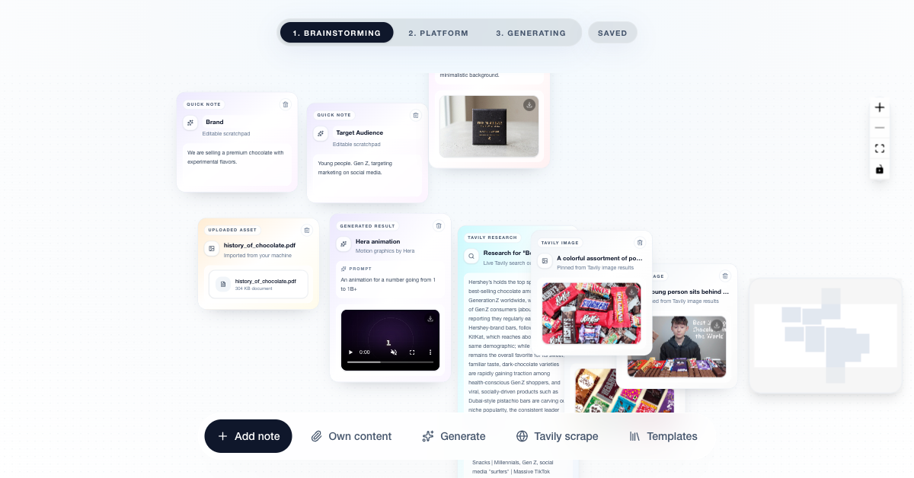

# VirallForge

**Live App:** https://virallforge.vercel.app/

**Video:** https://youtu.be/5si_R4oUAVU



## Hackathon Context

- Event: **Big Berlin Hack**
- Track: **Hera - AI Agents for Video Generation**
- Public repo: https://github.com/fabienstrauss/big-berlin-hack-2026

## Partner Technologies Used

Technologies counted for submission:

- **Google DeepMind (Gemini / Veo)** for image and video generation
- **Tavily** for live web research and reference extraction
- **Gradium** for optional manual text-to-speech voiceover generation

Additional integrated generation provider:

- **Hera** for animation outputs

## Product Overview

VirallForge provides a canvas-based workflow for creating and refining campaign content:

- Build ideas visually in a workspace canvas.
- Configure platform, audience, content type, and template for:
  - Instagram
  - TikTok
  - LinkedIn
  - X / Twitter
  - YouTube
- Select output formats:
  - Content types: Short Video, Image
  - Aspect ratios: Vertical (9:16), Square (1:1), Horizontal (16:9)
  - Template selection per content type
- Generate image/video concepts with Gemini (Nano Banana + Veo).
- Generate animation clips with Hera.
- Pull live research snippets and reference images via Tavily.
- Enrich generation inputs with external Tavily context through context extraction and context pack flows.
- Extract and merge workspace context for downstream campaign generation.

## Product Next Steps (Planned)

- Automatic thumbnail generation for generated video content.
- Hashtag recommendation generation per platform and audience.
- Performance dashboard to monitor post-level and campaign-level outcomes.

## Tech Stack

- Next.js `16.2.4`
- React / React DOM `19.2.4`
- TypeScript
- Tailwind CSS v4
- Supabase (`@supabase/supabase-js`)
- React Flow (`reactflow`)
- Gemini API (image + video generation)
- Hera API (animation generation)
- Tavily API (search + image references)

## Local Setup

### 1. Install dependencies

```bash
npm install
```

### 2. Configure environment variables

```bash
cp .env.example .env.local
```

Required keys:

```env
# Supabase
NEXT_PUBLIC_SUPABASE_URL=
NEXT_PUBLIC_SUPABASE_ANON_KEY=

# Gemini / Veo
GEMINI_API_KEY=

# Hera animation generation
HERA_API_KEY=

# Tavily search
TAVILY_API_KEY=

# Gradium voiceover add-on
GRADIUM_API_KEY=
GRADIUM_VOICE_ID=
```

Runtime behavior when keys are missing:

- `/api/generate`
  - `image` / `video`: returns mock payload when Gemini is missing or generation fails.
  - `animation`: returns mock payload when Hera is missing.
- `/api/search`
  - Returns mock payload when Tavily is missing or request fails.
- `/api/campaign/generate`
  - Returns `503` when Gemini is not configured.
- `/api/campaign/voiceover`
  - Returns `503` when Gradium is not configured.
- Context extraction/packing endpoints depend on Supabase env values.

### 3. Run locally

```bash
npm run dev
```

Open `http://localhost:3000`.

## Supabase Setup

Apply [`supabase/schema.sql`](supabase/schema.sql) to your Supabase project.

It creates required persistence and storage resources, including:

- `public.canvas_state`
- `public.campaign_config`
- `public.workspace_context_artifacts`
- `public.workspace_context_packs`
- `public.generated_content`
- Buckets: `canvas-assets`, `templates`, `generated-content`

## API Routes

- `POST /api/generate`
- `POST /api/search`
- `POST /api/context/extract`
- `POST /api/context/pack`
- `POST /api/campaign/generate`
- `POST /api/campaign/voiceover`
- `DELETE /api/campaign/generate`
- `POST /api/templates/apply`

## Gradium Voiceover Add-On

Manual voiceover generation is available in Step 3 result cards for completed video outputs.

1. Click **Add voiceover** on a video card.
2. Enter or edit narration text.
3. Click **Generate voiceover** to create audio.
4. Preview with the built-in audio player and use **Download** for manual editing workflows.

This is intentionally isolated from the Veo generation path and does not alter video generation behavior.

## Project Structure

- `app/components/workspace/*` — UI for choice flow, canvas, controls
- `app/hooks/*` — board/config state handling
- `app/lib/providers/*` — Gemini, Hera, Tavily, env/provider wiring
- `app/lib/context/*` — extraction, merge, fingerprint, persistence
- `app/lib/campaign/*` — prompt builder + generation orchestration
- `app/api/*` — server route handlers

## Deployment

Production:

- https://virallforge.vercel.app/

## Scripts

```bash
npm run dev
npm run build
npm run start
npm run lint
```
